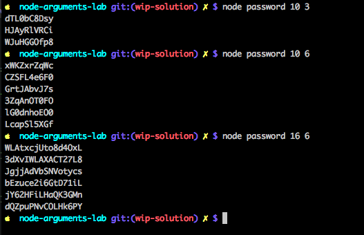

# Node Arguments Lab

You've been hired to enhance security at a major US bank amidst the breach in their database. As a security expert you know to that offering users randomly generated passwords will make it hardly for pesky hackers to brute force the attack. This app must use command-line interface and be flexible to be used for passwords of different length and for various number of passwords.

In this lab, you will pass and access command-line arguments to implement a CLI app which generates random passwords.

## Objectives

1. Implement a CLI app which generates random passwords
1. Use two arguments. One for length of the password and another for the number of randomly generated passwords.

## Introduction

I'm sure we all know those people that use the same password over and over again for all their online logins. That's obviously not safe because if someone hacks into one account, they can easily get into all of them. Your job is to build a CLI application that generates a random secure password. In order to generate the appropriate amount amount of passwords (sometimes you need two passwords!) with the appropriate number of characters, this application should accept two command-line arguments.



## Instructions

1. Implement a Node script `password.js` which takes CLI arguments and prints random passwords based on the arguments
1. Use two arguments: length (first) and a number of passwords (second) to print, so that `node password 2 2` and `node password 10 3` are valid commands. The former will print 2 passwords with the length of 2 and the latter 3 passwords with the length of 10.
1. Implement `generatePassword()` function in the `password.js` to get random passwords. If it's too hard, look up our implementation below in Extra Info.
1. Finish program with `process.exit(0)`
1. Run `npm test` to test


### Extra Info

The password generator function:

```js
var generatePassword = function generatePassword(length, charset) {
    var length = length || 8,
        charset = charset || 'abcdefghijklnopqrstuvwxyzABCDEFGHIJKLMNOPQRSTUVWXYZ0123456789',
        password = '';
    for (var i = 0, n = charset.length; i < length; ++i) {
        password += charset.charAt(Math.floor(Math.random() * n))
    }
    return password
}
```

* [JavaScript password generator on Stackoverflow](http://stackoverflow.com/questions/1497481/javascript-password-generator)
